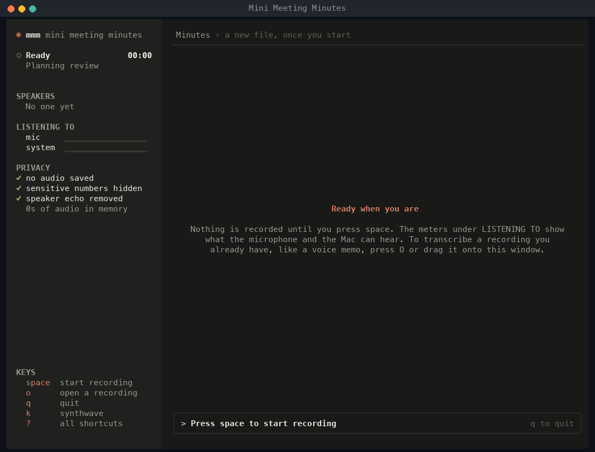

# Mini Meeting Minutes

Mini Meeting Minutes writes down what was said in your meetings, and who said it, entirely on your
Mac. It listens to the people in the room and the people on your call, and saves the conversation
as plain text you can keep, search and share, with your own notes in place.

https://github.com/user-attachments/assets/f4e27757-700d-408d-a34e-b7e1553a0507



*A short meeting (made with macOS voices) running about four times faster than real time.
Recording starts once everyone's agreement is confirmed, and words appear as they're spoken. A
note gets added, synthwave mode makes an appearance, and the speakers get named at the end.*

## What it's for

Minutes are only as useful as they are accurate, and only as safe as the place they're kept.
Mini Meeting Minutes is built around a few promises:

- **Nothing leaves your Mac.** Speech recognition, telling voices apart, echo removal and
  redaction all run on your Mac's own chips. The app makes no network connections, and there's no
  account, cloud service or subscription.
- **No audio is ever saved.** Sound stays in memory only as long as it takes to transcribe (about
  30 seconds at most), then it's gone. Only the written minutes are kept.
- **Word for word.** No AI summaries and no generative models: the minutes are what was said, by
  who said it.
- **Consent first.** Nothing is recorded until you confirm that everyone taking part knows and
  agrees.
- **For focused sessions, not every meeting.** It's meant for sessions where everyone has agreed to
  a transcript, such as user research or stakeholder interviews. Your company's policy may not allow
  recording routine meetings, so check with your risk advisors before using it.
- **Sensitive numbers blanked out.** Social Security, card and account numbers are removed before
  anything is shown or saved. Names, emails and phone numbers can be too.
- **Works where you meet:** in person, on a call, or both, with speakers or headphones, and with
  any meeting app.
- **Easy for anyone.** One line to install, a Desktop shortcut to start, and a few keys to learn.
- **Nothing hidden.** It's open source, and every speech model ships in this repository, with
  checksums and licenses.

Read more in [Features](docs/FEATURES.md) and [Privacy and security](docs/PRIVACY-AND-SECURITY.md).
The minutes it saves look like this:

```markdown
**Room 1** · 00:00:17
That is concerning. Can you send me the full breakdown? My email is jane.doe@example.com.

> **Note** · 00:00:21
> Ask finance for the breakdown before Friday

**Remote 2** · 00:00:24
I can help with that. You can also call me at 415-555-0132 if anything is unclear.
```

## Install

You need a Mac with Apple silicon (M1 or newer) running macOS 15 or newer. Installing takes about
10 minutes, once.

1. Open **Terminal**: press **⌘ Space**, type **Terminal**, and press **Return**.
2. Copy this line, paste it into Terminal with **⌘ V**, and press **Return**:

   ```
   curl -fsSL https://raw.githubusercontent.com/dudgeon/mini-meeting-minutes/main/install.sh | bash
   ```

3. If a window asks to install the **command line developer tools**, click **Install**, then
   **Agree**. The installer waits for them and carries on by itself.
4. When Terminal says **All set!**, you're done. You can close Terminal.

## Record a meeting

1. Double-click **Mini Meeting Minutes** on your Desktop.
2. The first time, your Mac asks whether **Terminal** may use the microphone and record system
   audio. Click **Allow** both times.
3. Press **Space** to start recording, then **Y** to confirm that everyone taking part knows the
   conversation is being recorded and transcribed, and has agreed. Nothing is recorded until then,
   but the meters already move, so you can check that your microphone is heard.
4. To jot something down, just type it and press **Return**. It goes into the transcript at the
   moment you started typing. **Space** pauses and resumes: a note never starts with a space, so
   the two don't clash. Other commands start with a slash, so a note can never set one off:
   **/name** to name the speakers, and **/help** for the rest.
5. When the meeting is over, type **/stop** and press **Return** (or press **Ctrl-C**). Type a
   name for each speaker (or press **Return** to skip them). Then press **Return** to open your
   minutes, **Space** to record another meeting, or **Q** to quit.

Your minutes are saved in the **Minutes** folder inside **Documents**, and their full path is copied
to the clipboard. That's handy for pasting into an AI assistant to work with them next. To copy the
whole transcript instead, press **T** once they're saved, or type **/copy** during a meeting for the
transcript so far.

### Transcribe a recording you already have

Voice memos and other recordings work too. On the ready screen, press **O** and choose the
recording, or drag it onto the window. For a voice memo, first drag it from Voice Memos to your
desktop. Press **Y** to confirm that everyone in it knew it was being recorded and agreed. It then
plays through like a sped-up meeting: words and speakers fly by as fast as your Mac can go, and an
hour-long recording takes about a minute on a recent Mac. The recording itself is only read,
never copied or changed.

## Something not right?

- **People on the call are missing.** Open **System Settings › Privacy & Security › Screen &
  System Audio Recording** and turn on **Terminal** under **System Audio Recording Only**. Then
  quit Terminal (**⌘ Q**) and start again.
- **People in the room are missing.** Check which microphone it's using: its name is under **mic**
  in the sidebar. Press **M** before you start (or type **/mic** during a meeting) to choose
  another, and it's remembered for next time. If none is heard, open **System Settings › Privacy &
  Security › Microphone** and turn on **Terminal**.
- **One person appears as two speakers.** Give both the same name when you stop, and they're
  combined.

**To update**, paste the install line into Terminal again.
**To uninstall**, paste this line instead. Your minutes are kept.

```
curl -fsSL https://raw.githubusercontent.com/dudgeon/mini-meeting-minutes/main/install.sh | bash -s -- --uninstall
```

---

## Learn more

| | |
|---|---|
| [Features](docs/FEATURES.md) | Everything it does, and the kinds of meetings it works in |
| [Privacy and security](docs/PRIVACY-AND-SECURITY.md) | The trust model: what's kept where, what never leaves your Mac, and what redaction does and doesn't do |
| [Using it from Terminal](docs/USAGE.md) | The `mmm` command, keys, options, permissions, and what the installer does |
| [How it works](docs/HOW-IT-WORKS.md) | The pipeline, the models, and how fast it is |
| [Roadmap](docs/ROADMAP.md) | What's next, including running well on smaller Macs |
| [Development](docs/DEVELOPMENT.md) | Building, testing, diagnostics and the code layout |
| [Models](Models/README.md) | The vendored models, their licenses and citations |
| [Security policy](SECURITY.md) | How to report a vulnerability |

## Limitations

- **Speaker labels are anonymous and per channel.** Voices are told apart, but no one is
  identified until you name them. People sharing one microphone are separated by voice alone,
  which is harder than separating the room from the call.
- **Overlapping speech** is attributed to whoever dominates it.
- **Redaction is best effort,** and by default covers only ID, card and account numbers. Read your
  minutes before sharing them.
- **Echo removal is new** in the toolkit the app is built on (FluidAudio). If people on the call
  still show up as room speakers, wear headphones or use `mmm --no-mic`.
- **It needs a Mac with Apple silicon** (M1 or newer) and macOS 15 or newer. Name redaction, when
  switched on, is tuned for English.

## License

The code is available under the [MIT license](LICENSE). The models in `Models/` are third-party
works under their own licenses (CC-BY-4.0, MIT and Apache-2.0); see
[Models/README.md](Models/README.md) for each license, attribution and citations.
