# Ten directions for the live screen

These are mockups of the recording screen, not working code. Each one shows the same moment of the same meeting. Each is drawn on the 120 × 40 character grid a terminal uses, using only what a truecolor terminal can show: text, box drawing and half-block pixel art. Any of them could become a real skin behind the `K` key.

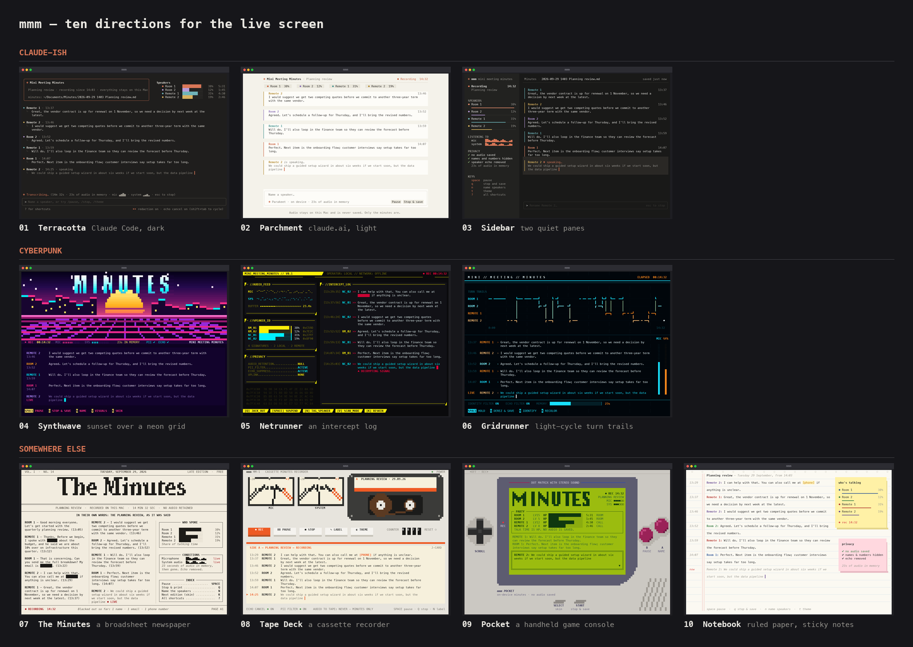

## Claude-ish

**01 · Terracotta.** This follows Claude Code's own dark terminal. It has a rounded welcome box and one `⏺` entry per turn, with the words under `⎿`. A `✻ Transcribing…` status line sits above a prompt box, where you name speakers or type `/pause`, `/stop` or `/theme`.

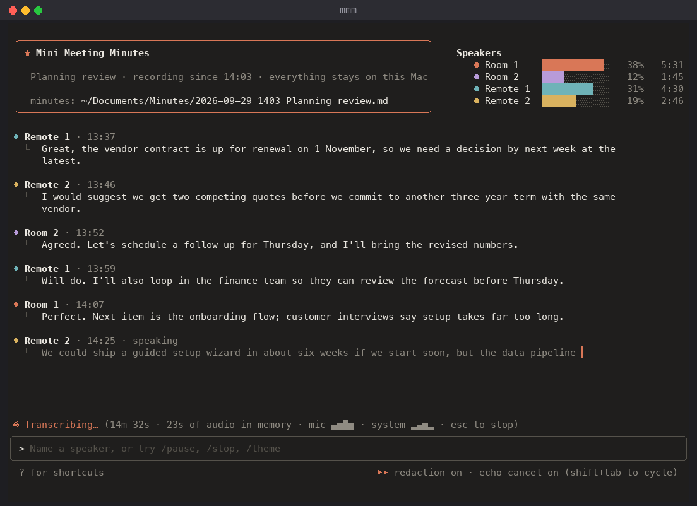

**02 · Parchment.** This takes claude.ai's warm, light page. Speaker chips run across the top. Each turn gets its own card, edged in the speaker's color, and a composer sits at the bottom.

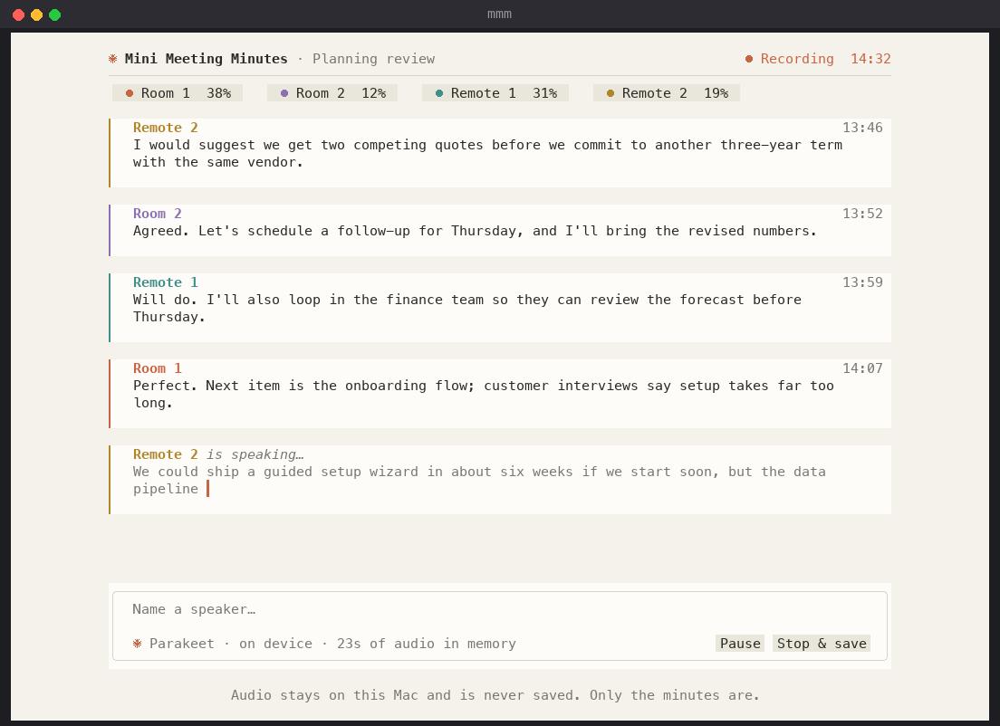

**03 · Sidebar.** Two panes. A quiet sidebar holds the status, talk time per speaker, input levels, privacy checks and keys. The transcript reads like a conversation.

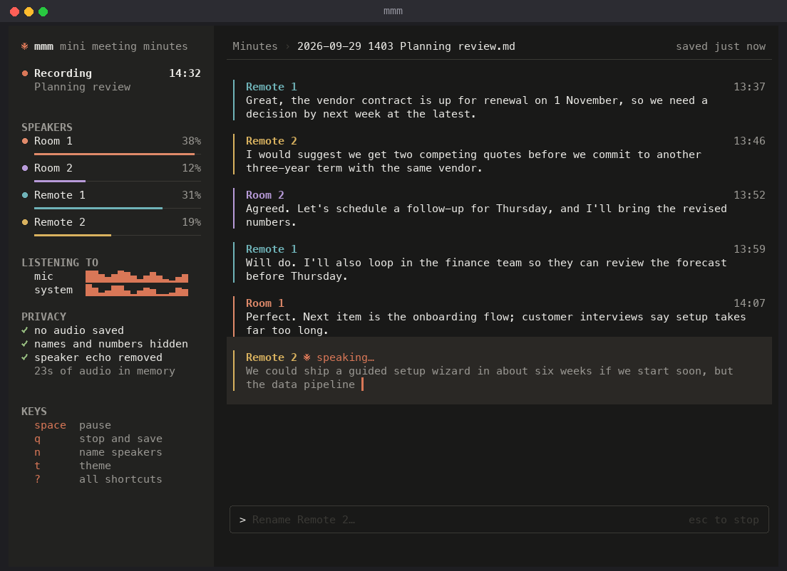

## Cyberpunk

**04 · Synthwave.** Today's retro look, pushed further: a pixel sunset over a neon grid. The city skyline is the live spectrum analyzer.

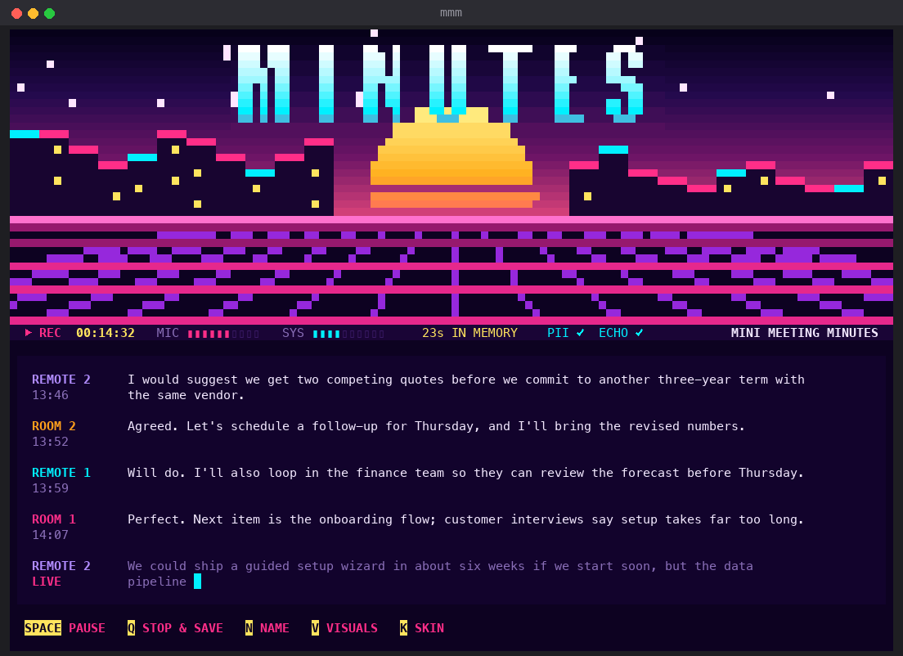

**05 · Netrunner.** A yellow-on-black cyberdeck. The transcript is an intercept log and speakers show as signatures. A privacy readout says `AUDIO_RETENTION … NULL`, and redactions appear as glitch blocks.

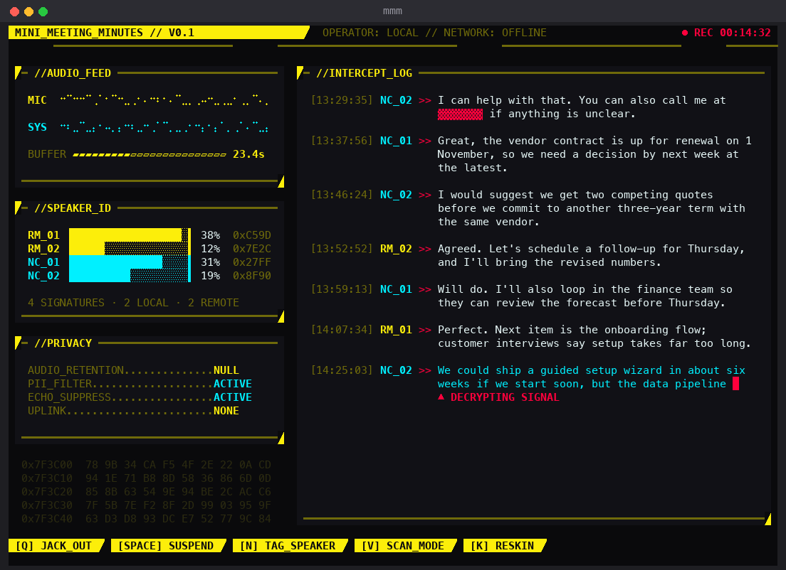

**06 · Gridrunner.** Light-cycle trails show who spoke when across the whole meeting. They sit above the transcript, with vertical meters for the mic and system audio.

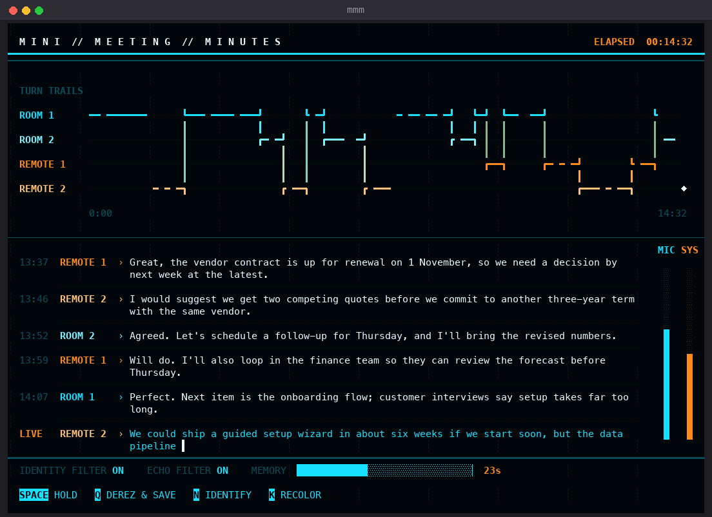

## Somewhere else

**07 · The Minutes.** A broadsheet newspaper, with a masthead and a dateline. Statements are set in columns and redactions are blacked out. Sidebar boxes cover who spoke, the input conditions and an index of keys.

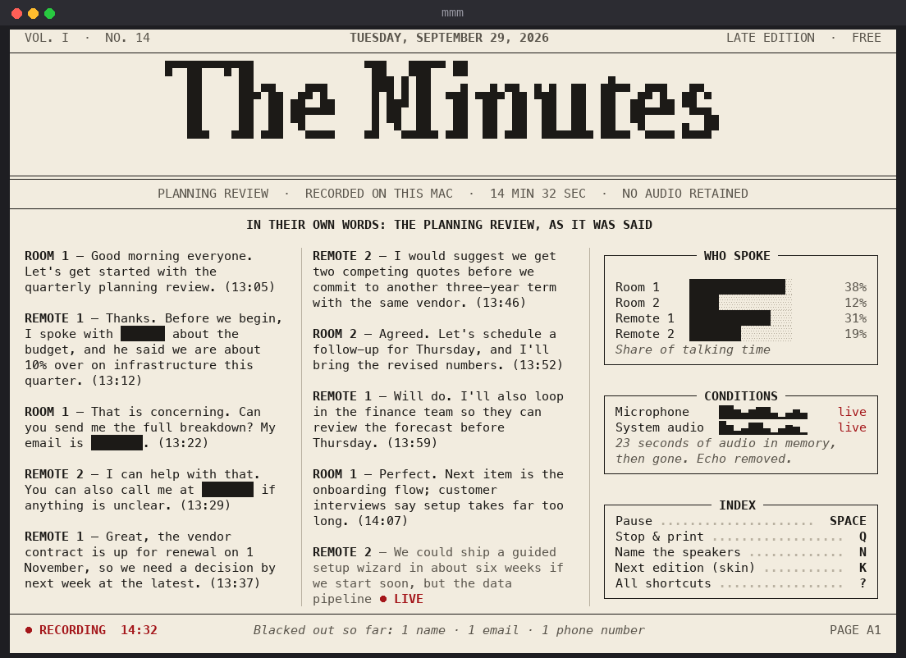

**08 · Tape Deck.** A Braun-style cassette recorder. It has VU meters for the mic and system audio, a labeled cassette, piano-key controls and a mechanical counter. The transcript is the cassette's J-card.

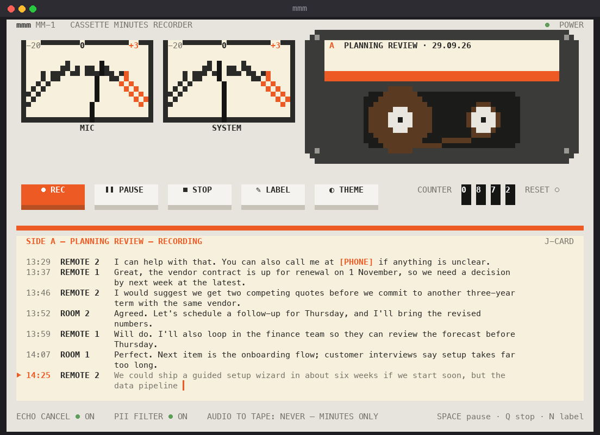

**09 · Pocket.** A handheld game console with a four-shade green screen. The speakers are a party, with talk time shown as HP. The live line is an RPG dialogue box, and the buttons map to the app's keys.

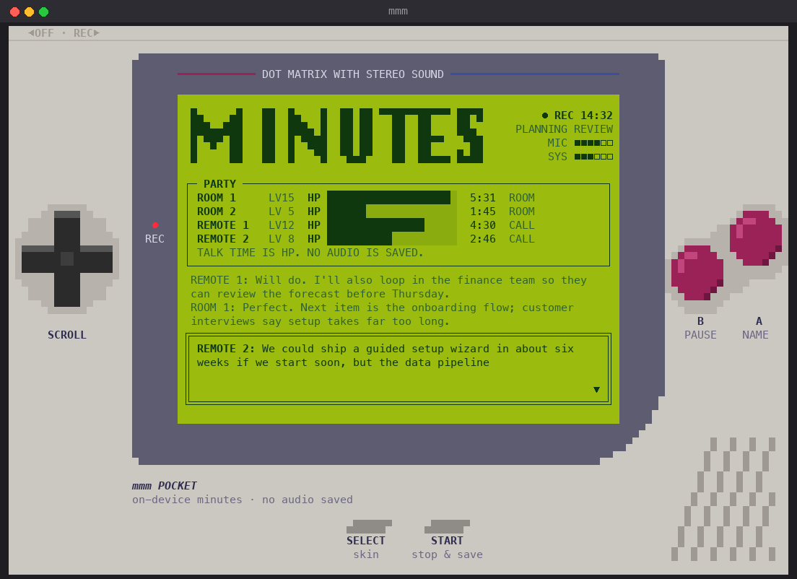

**10 · Notebook.** Ruled paper, with timestamps in the margin. Each speaker writes in their own pen color and redactions sit under a highlighter. Sticky notes hold the speakers and the privacy checks.

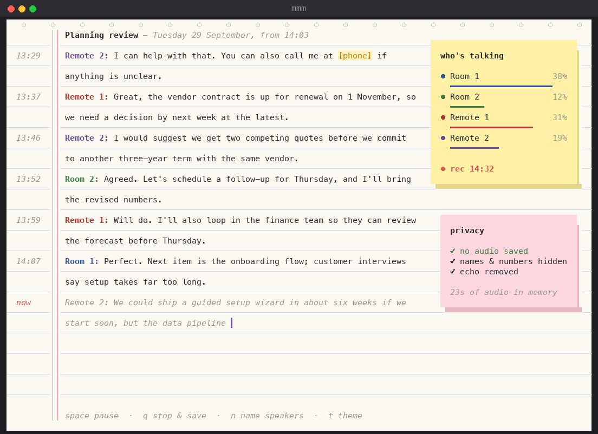

## Regenerating

The mockups come from a small Python script. It needs Pillow and the fonts that ship with macOS:

```sh
python3 -m venv /tmp/mockups && /tmp/mockups/bin/pip install pillow
/tmp/mockups/bin/python docs/redesigns/source/render_all.py
```

The meeting in every mockup is made up.
